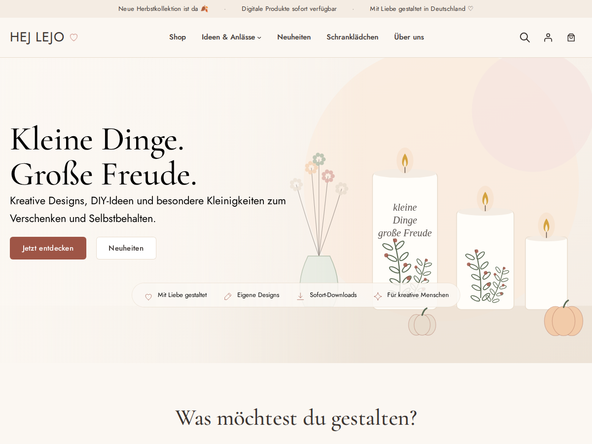

# Hej Lejo – WordPress Block-Theme

Modernes Full-Site-Editing-Theme für den Shop [hejlejo.de](https://hejlejo.de): ein ruhiger, skandinavischer
Handmade Concept Store mit WooCommerce-Blöcken, lokal gehosteten Schriften und Gutenberg-Patterns.

Das Theme verändert **keine** Produkte, Kategorien, Bestellungen, Medien oder SEO-Daten. Es arbeitet mit den
vorhandenen WooCommerce-Daten. Die Überarbeitung der Produktstruktur folgt in Phase 2.



---

## Voraussetzungen

| | Mindestens | Getestet mit |
|---|---|---|
| WordPress | 6.7 | 7.1.2 |
| WooCommerce | 9.5 | 10.6.2 (Staging) und 11.1.2 |
| PHP | 8.0 | 8.3 |
| Germanized für WooCommerce | 3.14 (Block-Unterstützung) | 4.1.4 |

Keine Build-Tools nötig: kein Node, kein Composer, kein Compiler. Das Repository **ist** das Theme.

## Installation

**Als ZIP (empfohlen für Staging/Live)**

```bash
git archive --format=zip --prefix=hejlejo/ -o hejlejo.zip HEAD
```

Dann in WordPress unter *Design → Themes → Theme hinzufügen → Theme hochladen* die `hejlejo.zip` hochladen und aktivieren.

**Per Git (z. B. auf einem Staging-Server)**

```bash
cd wp-content/themes
git clone <repo-url> hejlejo
```

Der Ordnername muss `hejlejo` sein (Text-Domain und Pattern-Slugs).

## Ersteinrichtung nach der Aktivierung

Alles Folgende sind manuelle Schritte in der WordPress-Oberfläche – das Theme legt selbst keine Inhalte an.

1. **Startseite:** Eine Seite „Startseite“ anlegen (oder die bestehende öffnen und den alten Elementor-Inhalt entfernen),
   im Inhaltsbereich das Pattern **„Hej Lejo / Seite: Startseite“** einfügen. Unter *Einstellungen → Lesen* als
   statische Startseite festlegen. Das Template `front-page` zeigt den Seiteninhalt ohne Titel in voller Breite.
2. **Schranklädchen / Über uns / Für dein Lädchen:** Seiten mit den Slugs `schranklaedchen`, `ueber-uns` und
   `fuer-dein-laedchen` anlegen, das passende Pattern „Hej Lejo / Seite: …“ einfügen und als Template
   **„Landingpage (volle Breite, ohne Titel)“** wählen. Header und Footer verlinken diese Slugs automatisch.
3. **Blog:** Eine leere Seite „Blog“ anlegen und unter *Einstellungen → Lesen* als Beitragsseite wählen.
4. **Rechtstexte:** Impressum, Datenschutz, AGB, Widerruf, Versand- und Zahlungsarten werden über die
   Germanized-/WooCommerce-Seitenzuordnung verlinkt. Für reine Textseiten gibt es das Template
   **„Textseite (schmal, z. B. Rechtliches)“**.
5. **Hauptmenü:** Der Header zeigt das WordPress-Menü **„Main“** – entweder das klassische Menü unter *Design → Menüs*
   oder ein gleichnamiges Block-Menü im Website-Editor. Gibt es keins, erscheinen Standardlinks.
6. **Logo:** Unter *Design → Editor → Muster/Template-Teile → Header* einen Logo-Block befüllen. Solange kein Logo
   gesetzt ist, erscheint der Schriftzug „HEJ LEJO ♡“.
7. **Platzhalterbilder austauschen:** Alle Bilder in den Patterns sind leichte SVG-Illustrationen aus
   `assets/images/placeholders/`. Im Editor einfach das Bild anklicken → *Ersetzen*.
8. **Texte prüfen:** Adresse und Öffnungszeiten im Schranklädchen-Pattern, Lizenz- und Versandhinweise im
   Akkordeon „Gut zu wissen“ auf den Produktseiten (*Editor → Templates → Einzelprodukt*) sind Beispieltexte.

## Theme-Konzept

- **Designsystem in `theme.json`:** Farbpalette (Off-White, warmes Dunkelgrau, Salbei, Dusty Rose, Apricot, Beige,
  Senfgelb, dazu Greige `#E4E0D6` und Salbeigrün `#818D77` der bisherigen Seite), zwei Schriften, fließende Schriftgrößen, Abstands-Skala, Button-Stil. Freie Farben, freie
  Schriftgrößen, Verläufe, Font Library und Openverse sind bewusst deaktiviert – das Design lässt sich nur mit den
  Theme-Presets gestalten und ist so schwer „kaputt zu editieren“.
- **Schriften lokal:** *Cormorant Garamond* (Überschriften) und *Quicksand* (Text & UI, wie auf der bisherigen Seite) als variable WOFF2 in
  `assets/fonts/` (SIL Open Font License). Keine Google-Fonts-Anfragen zur Laufzeit → **OMGF wird überflüssig**.
- **Kein Frontend-JavaScript des Themes.** Navigation, Mini-Cart, Galerie und Suche kommen aus WordPress/WooCommerce.
  Keine jQuery-Abhängigkeit durch das Theme. Das WordPress-Emoji-Skript wird entfernt (spart eine externe Anfrage).
- **Buttons in Hej-Lejo-Grün** `#69755F` – das Grün der bisherigen Seite (`#818D77`), minimal abgedunkelt, damit weiße
  Schrift gut lesbar bleibt (WCAG-Kontrast 4,9 : 1). In grünen Flächen werden Buttons automatisch hell (Greige).
- **Block-Stile statt Optionen:** z. B. Button „Sekundär (weiß)“ / „Hell (für grüne Flächen)“ / „Textlink mit Pfeil“, Website-Logo „Dunkel einfärben“, Gruppe „Karte“ / „Fläche“,
  Bild „Kreis“ / „Bogen“, Absatz „Dachzeile“, Liste „Häkchen“ / „Herzchen“, Details „Akkordeon“, Cover „Hero“.
- **Plugin-Kompatibilität vor Design-Spielereien:** Produktseite nutzt die klassisch kompatiblen Blöcke
  *Produktbildergalerie* und *Warenkorb-Formular* (Variation Swatches, Germanized, Zahlungs-Buttons funktionieren
  unverändert). Warenkorb und Kasse rendern einfach den Seiteninhalt – egal ob Cart/Checkout-Block oder Shortcode.

### Struktur

```
hejlejo/
├── style.css               Theme-Header
├── theme.json              Designsystem & Editor-Grenzen
├── functions.php           lädt inc/*
├── inc/
│   ├── setup.php           Theme-Supports, Styles, Font-Preload, Emoji aus
│   ├── block-styles.php    Block-Stilvarianten
│   ├── patterns.php        Pattern-Kategorien + Helfer (Links, Produktkarte)
│   ├── editor.php          Editor-Einschränkungen
│   ├── blocks.php          Registrierung der zwei Theme-Blöcke
│   └── woocommerce.php     FiboSearch, Tabs, Block-Hooks, Mini-Cart
├── blocks/
│   ├── product-highlights/ Block „Produkt-Vorteile“
│   └── product-badges/     Block „Produkt-Badges“
├── templates/              Seiten-, Blog- und WooCommerce-Templates
├── parts/                  Header, Hinweisleiste, Footer, Kasse-Header, Beitragskarte
├── patterns/               alle Patterns (PHP, automatisch registriert)
└── assets/
    ├── css/                theme.css, woocommerce.css, editor.css
    ├── js/editor.js        entfernt unpassende Core-Stilvarianten im Editor
    ├── fonts/              WOFF2 + Lizenzen
    └── images/             Icons + Platzhalter-Illustrationen
```

### Templates

`front-page`, `page`, `page-landing`, `page-narrow`, `home` (Blog), `single`, `archive`, `search`, `404`, `index`
sowie für WooCommerce `archive-product`, `taxonomy-product_cat`, `taxonomy-product_tag`,
`taxonomy-product_attribute`, `product-search-results`, `single-product`, `page-cart`, `page-checkout`.

### Patterns (im Editor unter „Hej Lejo – …“)

| Pattern | Inhalt |
|---|---|
| Hej Lejo / Hero | Markenbild, Headline, 2 Buttons, Vorteile; mobil Bild oben |
| Hej Lejo / Kategorien | „Was möchtest du gestalten?“ – 4 zentrierte, komplett klickbare Karten mit Illustration |
| Hej Lejo / Hero (für überlappende Karten), Kategorien (überlappend) | Hero + Karten, die den Hero überlappen (wie dille-kamille.de) |
| Hej Lejo / Anlässe (grün) | Anlass-Icons auf grüner Fläche |
| Hej Lejo / Schranklädchen-Business (groß) | „Du hast selbst ein Schranklädchen?“ – großer grüner Bereich |
| Hej Lejo / Vorteile (Zeile) | vier Vorteile mittig in einer Zeile |
| Hej Lejo / Anlässe | „Für welchen Moment suchst du etwas?“ – 9 Icons |
| Hej Lejo / Neuheiten | „Gerade neu eingezogen ♡“ – 6 neueste Produkte |
| Hej Lejo / Bestseller | 4 meistverkaufte Produkte |
| Hej Lejo / Drei-Schritte-Anleitung | „So einfach wird aus einer Kerze …“ |
| Hej Lejo / Text & Bild | Bild + Dachzeile, Headline, Text, Button |
| Hej Lejo / Business CTA | „Du hast selbst ein kleines Lädchen?“ |
| Hej Lejo / Freebie & Newsletter | „Eine kleine Freude für dich ♡“ |
| Hej Lejo / Business + Freebie | beide Karten nebeneinander |
| Hej Lejo / Instagram-Raster | „Hej Lejo in echt ♡“ – 6 Bilder |
| Hej Lejo / Service-Leiste | Sicher einkaufen, Sofort-Download, … (auch im Footer) |
| Hej Lejo / Schranklädchen Hero, … Infos | „Hier hat alles angefangen.“, Öffnungszeiten, Standort, Bezahlung |
| Hej Lejo / Bildergalerie, Social-Hinweis | Galerie, Instagram-Link |
| Hej Lejo / Über-uns Hero, Unsere Geschichte | Portrait, Weg vom Schranklädchen zum Online-Shop |
| Hej Lejo / FAQ, Neueste Beiträge, Produkt: Gut zu wissen | Akkordeon, Blog-Teaser, Produkt-Infos |
| Hej Lejo / Hero (schlicht) | Greige-Fläche mit Dachzeile, Überschrift, Button; Foto ragt unten heraus (wie dille-kamille.de) |
| Hej Lejo / Seite: Startseite, Startseite (schlicht), Startseite (Variante B – Greige & Grün), Schranklädchen, Über uns, Für dein Lädchen | komplette Seiten (erscheinen beim Anlegen einer neuen Seite) |

Links in Kacheln und Menü zeigen zuerst auf eine **vorhandene** Produktkategorie mit passendem Slug
(z. B. `kerzentattoos`, `herbst`), sonst auf die Produktsuche (z. B. `?s=Geburtstag&post_type=product`).
Alle Links können im Editor frei geändert werden. Es werden keine Kategorien oder Taxonomien angelegt.

## WooCommerce-Details

- **Produktkarten:** quadratisches Bild, Titel, Preis, Germanized-Pflichtangaben (ohne Kategorien). Shop-Übersicht 3-spaltig, mobil 2-spaltig.
- **Produktfilter** (Shop, Kategorien, Schlagwörter, Suche): WooCommerce-Block „Produktfilter“ mit *Kategorie*, *Produktart*
  (= Schlagwörter) und *Preis*. Desktop als mitlaufende Seitenleiste, mobil hinter dem Button „Produkte filtern“.
  Anpassbar im Website-Editor in den Shop-Templates (z. B. *Templates → Produktkatalog*).
- **Badges** (Block „Produkt-Badges“): Schlagwörter mit den Slugs `neu`, `bestseller`, `handmade`, `sofortdownload`
  werden zum Badge, dazu automatisch „Sale“ und „Sofort-Download“ (herunterladbare Produkte). Optional „Neu“ für
  Produkte der letzten X Tage. Weitere Slugs per Filter `hejlejo_badge_tag_slugs`.
- **Produkt-Vorteile** (Block auf der Produktseite): „Sofort-Download“ bei herunterladbaren Produkten bzw.
  „Digitales Produkt“/„Versand“ sowie sichtbare Produkteigenschaften, deren Name *Format, Datei, Lizenz, Nutzung,
  Material* oder *Handmade* enthält (Filter `hejlejo_product_highlight_attribute_keywords` und `hejlejo_product_highlights`).
- **Produktseite:** links Galerie, rechts (Desktop mitscrollend) Badges, Titel, Bewertung, Preis,
  Germanized-Angaben, Kurzbeschreibung, Varianten/Warenkorb, Vorteile, Artikelnummer. Darunter die
  WooCommerce-Tabs (inkl. Tabs von Plugins, z. B. Produktsicherheit), das Akkordeon „Gut zu wissen“ und ähnliche Produkte.
- **Germanized:** Germanized gibt bei Block-Themes die Preisangaben nicht automatisch aus, sondern stellt eigene
  Blöcke bereit. Das Theme setzt *Grundpreis, MwSt.-Hinweis, Versandkosten-Hinweis, Lieferzeit* und
  *Mängelbeschreibung* auf der Produktseite sowie *Grundpreis, MwSt., Versand* in den Produktkarten ein.
  Ohne Germanized geben diese Blöcke nichts aus. **Bitte auf Staging die Preisauszeichnung juristisch prüfen.**
- **Mini-Cart:** WooCommerce-Block mit Drawer → **Side Cart WooCommerce wird überflüssig.** Auf der Warenkorbseite
  selbst wird der Mini-Cart ausgeblendet.
- **Kasse:** eigener, reduzierter Header (Logo + „Sicher bezahlen“), sonst unverändertes WooCommerce-Markup.
  Der Checkout-Block wird empfohlen (Germanized, WooPayments und PayPal unterstützen ihn); eine Shortcode-Kasse
  funktioniert ebenfalls.
- **Suche:** Ist **FiboSearch** aktiv, zeigt der Header auf großen Bildschirmen ein Suchfeld und mobil eine Lupe mit
  Vollbild-Suche (`[fibosearch layout="icon-flexible"]`,
  anpassbar per Filter `hejlejo_header_search_shortcode`). Ohne FiboSearch: aufklappende WordPress-Produktsuche.
- **Wunschliste:** nur vorbereitet. WooCommerce bringt ab Version 11 einen (noch experimentellen) Wunschlisten-Block
  mit; alternativ kann der Block/Shortcode eines Wunschlisten-Plugins in den Header-Bereich
  `hejlejo-header__actions` gesetzt werden.
- **Newsletter:** Das Freebie-Pattern enthält einen Button (Link auf `/newsletter/`). Sobald ein Newsletter-Plugin
  gewählt ist, den Button durch dessen Block oder einen Shortcode-Block ersetzen – die Gruppe `hejlejo-newsletter`
  ist dafür vorgesehen.

## Plugins

**Weiterhin kompatibel / empfohlen:** WooCommerce, Germanized, Shiptastic, DHL/UPS, WooPayments,
WooCommerce PayPal Payments, FiboSearch, Rank Math SEO, Real Cookie Banner, FluentSMTP, LiteSpeed Cache, Statify,
UpdraftPlus, PDF Invoices & Packing Slips, Product Variation Swatches.

**Werden durch das Theme überflüssig** (nach erfolgreichem Staging-Test deaktivieren):

| Plugin | Ersatz |
|---|---|
| Elementor | Gutenberg + Patterns (vorher alle Elementor-Seiten neu aufbauen!) |
| Max Mega Menu | Navigations-Block mit Untermenü |
| StoreCustomizer | Templates / theme.json |
| Spiraclethemes Site Library, WP Child Theme Generator | nicht mehr nötig |
| Side Cart WooCommerce | Mini-Cart-Block mit Drawer |
| OMGF | lokal eingebundene Theme-Schriften |

## Getestet

Lokal mit WordPress 7.1.2, WooCommerce 11.1.2, Germanized 4.1.4, FiboSearch 1.34, WooPayments 11.1,
PayPal Payments 4.1 (Zahlungsanbieter ohne Konto, nur auf Fehler geprüft):

- Startseite, Shop, Kategorie-/Schlagwort-Archive, Produktseite (einfach, variabel, herunterladbar),
  Warenkorb, Kasse, Mein Konto, Produktsuche, Suche, Blog, Beitrag, 404, Mobile Navigation, Mini-Cart-Drawer
- Viewports 390 px (iPhone), 768 px (Tablet), 1440 px (Desktop): **kein horizontaler Überlauf**
- **Keine PHP-Warnungen/-Notices** aus dem Theme; keine JS-Fehler aus dem Theme
- Alle Patterns, Templates und Template-Teile im Site Editor ohne ungültige Blöcke
- axe-core (WCAG 2 A/AA): keine Verstöße im Theme-Markup; verbleibende Hinweise stammen aus WooCommerce-Core
  (Mini-Cart-Drawer) bzw. Germanized
- Theme läuft auch ohne aktives WooCommerce fehlerfrei

**Auf Staging noch zu prüfen** (braucht echte Konten/Daten): Zahlungen mit WooPayments und PayPal,
Shiptastic/DHL-Versandarten, Product Variation Swatches mit echten Variationen, LiteSpeed-Cache
(CSS/JS-Optimierung testweise aus- und einschalten), Real Cookie Banner, Rank-Math-Breadcrumbs.

## Entwicklungsworkflow

Pragmatisches **Trunk-Based Development**:

- `main` ist immer installierbar.
- Änderungen in kurzlebigen Branches `feature/<thema>` bzw. `fix/<thema>`, per Pull Request nach `main`.
- Releases als Git-Tag (`v1.0.0`) und `Version` in `style.css` hochzählen; daraus mit `git archive` (s. o.) die ZIP bauen.
- Änderungen, die im Site Editor gemacht wurden, landen in der Datenbank und nicht im Theme. Sollen sie ins Theme,
  im Editor über *Optionen → Werkzeuge → Exportieren* bzw. per Copy & Paste des Block-Markups übernehmen.
- Keine Secrets, Zugangsdaten oder `wp-config.php` committen (siehe `.gitignore`).

## Lizenz

Theme: GPL-2.0-or-later. Schriften: SIL Open Font License 1.1 (siehe `assets/fonts/`).
